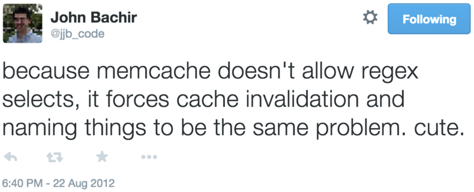
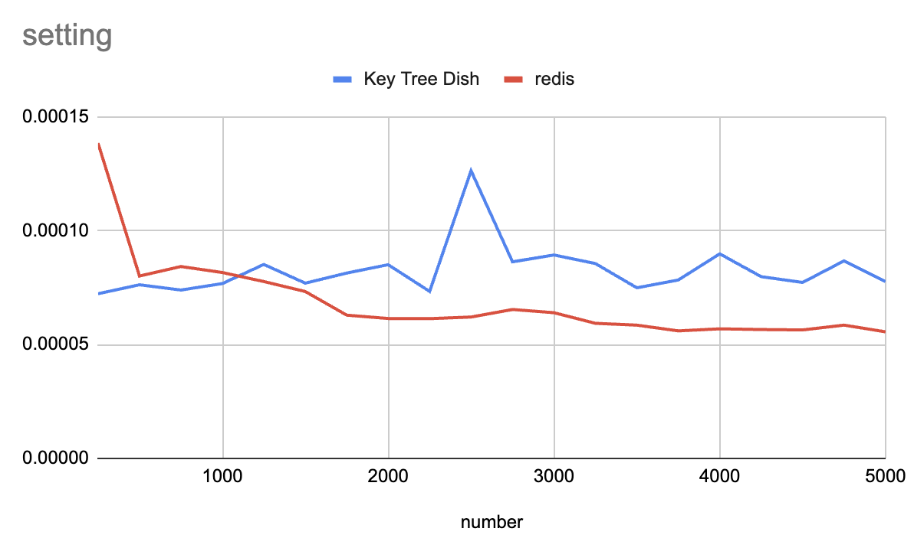
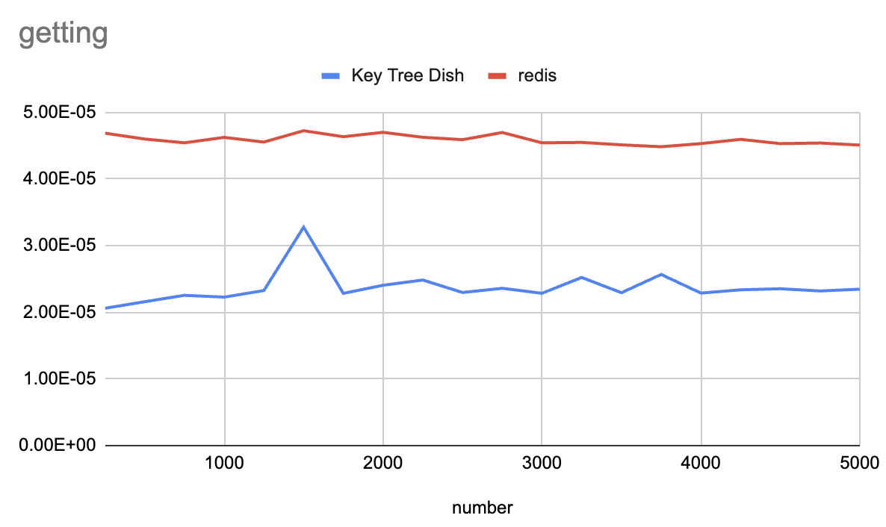

Here's an experiment I made around 2012-15 and recently was reminded of during a discussion about
37 signal's new cache store, https://github.com/rails/solid_cache. I had this code sitting on my computer and never pushed it up to github, and the below is a blog post I wrote around that time and never published.

----

I think there's a gap in persistence system offerings. The use case I have in mind is a system that has a large number of large objects that need to be cached -- say a 200kB html document. Let's say:

1. most of these documents aren't very popular
2. many of them are accessed pretty often (a few times a day)
3. some of them are accessed very often
4. it is pretty expensive to generate a non-cached version of them

Perhaps put more simply: the popularity of each individual page is pretty similar, so it's difficult to make big performance gains by only caching the top x% popular pages. One would like to have all content in the site cached.

However, it is expensive to keep enough machines with enough RAM available to memcache or redis to achieve this.

The solution is to generate a static cache of the website and keep it on disk. This works for a single-server environment, or a highly customized environment where many servers are set up to access a NAS or something similar. But neither of those solutions are very [12-factor](http://12factor.net/).

What we would like is a memcache-like system, but with much cheaper storage. Getting this in exchange for less performance is acceptable for objects of this size. So, in a nutshell, I want a key-value store that's 1/10 the storage cost of memcache, and it's okay if it's 1/10 the speed as well.

Another problem I have with memcache and redis is they are underfeatured for managing higher-level composed objects, because it takes extra application logic to figure out how to expire the object (when any 1 of dozens of sub-objects are changed), and there is no way to expire a group of objects. Put another way:

I would like the ability to expire a tree of entries using the leading namespace of the key. e.g.: expire all entries with keys that begin with "post-123-comments-". I realize that this feature is a bit orthogonal to the size/speed tradeoff goals described above, but I don't think it is incompatible with it. I am still exploring if it is in some way a natural fit, or if it's merely a nifty feature that I've always wanted in a caching system and I decided to throw in. :-D

To implement this system easily, we can probably assume that the disk is SSD. And maybe that's why this particular type of caching system isn't around yet, because SSD is what allows for this price/performance/storage-size balance.

Looking at [digital ocean pricing](https://www.digitalocean.com/pricing/):
* in ~2012-15, an $80/month server got you 8GB of RAM and 80GB of SSD, which pretty cleanly validated my 1/10 price idea
* in 2023, a $96/month server will get you 16GB of RAM and 320 GB of SSD, which is 1/20 the price!

But what about the performance? Will it be 1/10, or worse?

My first stab at a design:

1. keep the index in memory
2. keep the data on disk
3. allow trees to be snipped (delete where key matches `foo-1-*`)

([Sean](https://www.linkedin.com/in/seancribbs/) informed me that [bitcask](https://github.com/basho/bitcask) does 1 and 2, but I want 3! Also, bitcask implements a log-style write scheme, which is only useful when dealing with spinning HDDs where data being sequential is necessary for good performance. So assuming SSDs can free us from this complexity.)

My first thought is that perhaps the OS and filesystem will implement most of what I'm looking for. Blobs can be stored in a directory structure, e.g.  `/foo/1/bar/2.blob` which correlates with `foo-1-bar-2`. Getting a blob will be a simple act of checking if a file is present in that path. Invalidating a blob will be done by deleting the file, invalidating a namespace prefix will be done by deleting (or moving) a directory. OSes and filesystems go to great lengths to cache files in memory, and these days it's quite smart and reliable, so much that ([Postgres actually relies on it for much of its own caching](https://devcenter.heroku.com/articles/understanding-postgres-data-caching#how-does-postgresql-cache-data)).

However, a problem with this approach is that the OS and filesystem aren't optimizing for the same thing we are. Namely, we are optimizing for consistent access times to all objects. The OS will be optimizing for the fastest possible access time to what it is guessing will be the most popular objects.

Our main goal is to always keep the index in memory. Will the OS and filesystem keep the index of the filesystem in memory at all times? I don't know.

## benchmarks

You can see some benchmark code in the benchmark directory. I'm using redis instead of memcache.

Here's a benchmark from 2023 on my laptop. In this contrived, unscientific, definitely not thorough benchmark, the gets
are faster than redis!

 
